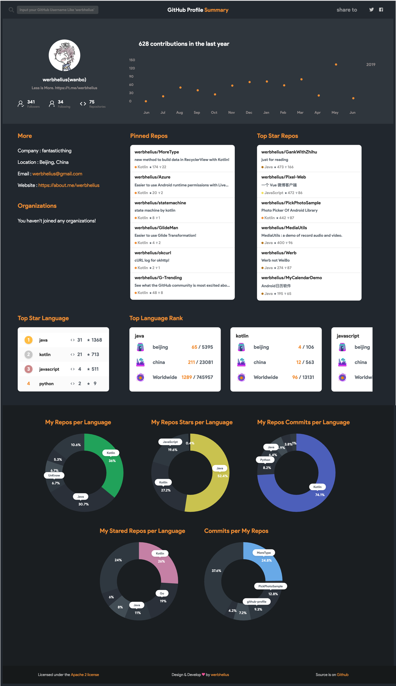

# Github Profile Summary

* Github user info
* Contributions in the last year
* Top star language
* Top language rank
* Repos language pie chart
* Star Languae pir chart
* Repos commits pie chart

## screenshot


### build
```
./gradlew clean build
```

### docker
```
docker build -t github-profile .
docker run -p 3000:8000 --rm github-profile
```

### docker with heroku
```
heroku login
heroku container:login
heroku container:push web --app APP_NAME   
heroku container:release web --app APP_NAME
heroku open --app APP_NAME  
```